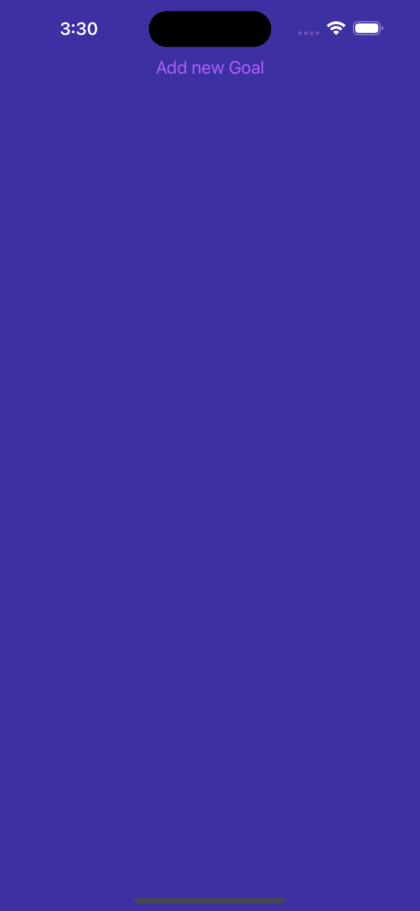
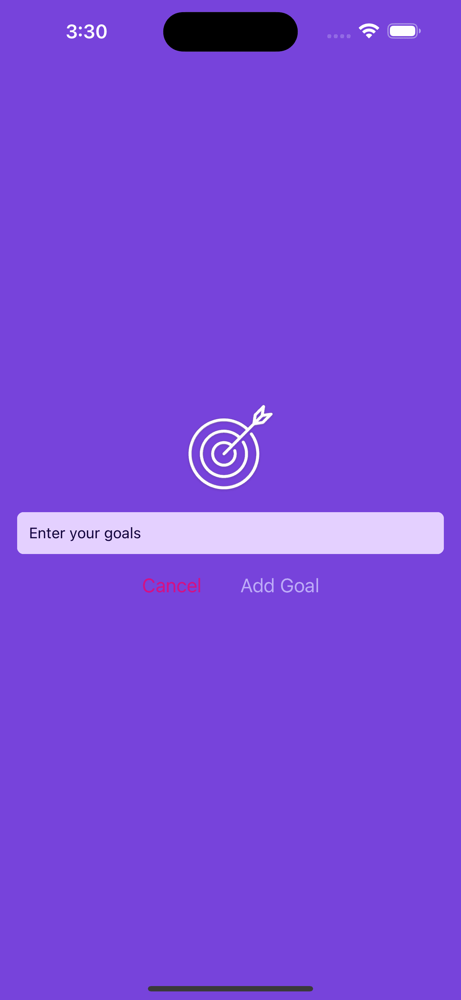
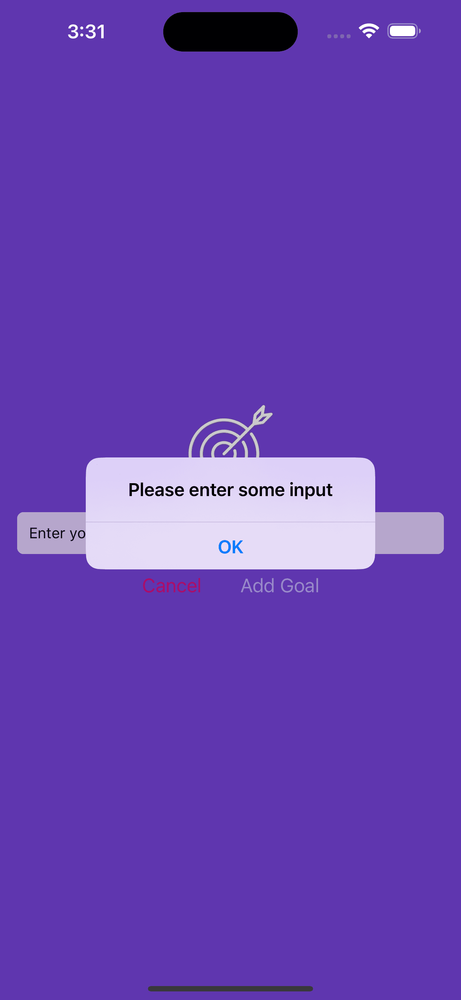
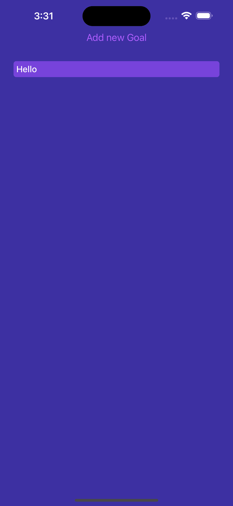

# Goal App

<p align="center">
  
  
</p>
<p align="center">
    
  
</p>

## Description

My this goal app is very simple and easy to useable to user. user can easily add goals or easily can delete in list. it's support android or ios mobiles.

<p align="center">
  
</p>

## Table of Contents

- [Installation](#installation)
- [Usage](#usage)
- [Features](#features)
- [Screenshots](#screenshots)
- [Configuration](#configuration)
- [Contributing](#contributing)
- [License](#license)
- [Acknowledgments](#acknowledgments)

## Installation

how to use my app you need to install clone the project and npm i or npm start scan the bar code other wise you can skip it just press a for android or press i for ios.

```bash
# Clone the repository
git clone https://github.com/jsidd06/goal-android-ios-app.git

# Install dependencies
npm install

# start expo command
npm start

# start in android
press a

# start in ios
press i
```
